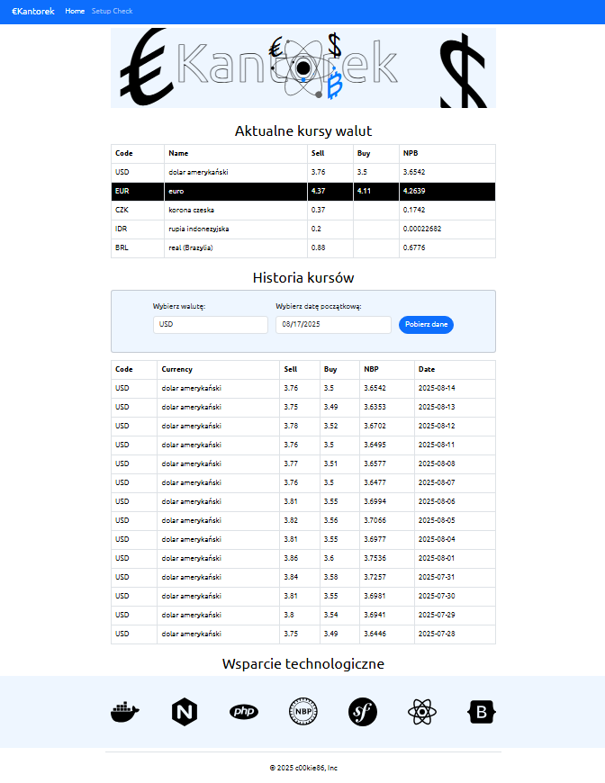

<!-- title -->
<h1 align="center">&#8364;Kantorek</h1>

<!-- background -->
<div align="center">
  
</div>

<h2 align="center">Symfony + React.js application with NGINX as FastCGI proxy for PHP-FPM</h2>

### Info
```bash
# Meta
- Tabela wymiany walut | EKantorek
- Czytelny i funkcjonalny interfejs do prezentacji danych dla pracowników kantoru wymiany walut

# Frontend
1. Nagłówek
- Baner .svg 

2. Aktualne Kursy
- Listy bieżących kursów sprzedawanych walut:
  - Kod waluty
  - Nazwa waluty
  - Kurs sprzedaży
  - Kurs kupna
  - Średni kurs

3. Kurs historyczny
- Pole wyboru waluty i daty
- Lista ostatnich 14 kursów (domyślnie: USD, aktualny kurs)
  - Kod waluty
  - Nazwa waluty
  - Kurs sprzedaży
  - Kurs kupna
  - Średni kurs
  - Data

4. Stopka
- Wsparcie technologiczne: Docker, NGINX, PHP-FPM, NBP, Symfony, React, NBP, Boostrap
- Copyrights 2025 c00ki86

# Backend
- Dane w aplikacji pobierane z API Symfony (API platform v2.6.x ???)
- Dane w API Symfony pobrane z API NBP
- Dane z API NBP przeliczone i zapisane do pliku data/file.json  
- API wystawione na podstawie danych z plioku Symfony API

# Etag
"Nowy Etag w Symfony przekazany do NGINX wymusza na kliencie
przy walidacji pre-requesta pobranie nowych danych"

# Pre-rendering
"Można zapisać do .html zubdowane oraz wyrenderowane przez Symfony
szablon (Twig) i komponenty React.js (Webpack Encore).
A następnie serwować je przez NGINX jako statyczne strony i przebudowywać
tylko przy aktualizacji kursu"

# Obsługiwane waluty
- Kantor obsługuje waluty:
[EUR, USD, CZK, IDR, BRL]

# Zasady ustalania kursów
- EUR, USD:
średni kurs NBP - 0,15 PLN = kurs kupna
średni kurs NBP + 0,11 PLN = kurs sprzedaży

- CZK, IDR, BRL:
kantor nie skupuje tych walut (brak kursu kupna)
średni kurs NBP + 0,20 PLN  = kurs sprzedaży

# Obsługa błędów
- Brak danych z NBP
- Nieobsługiwana waluta
- Niepoprawna data

# Testy
- Jak działa to po co testować xd

# Jak uruchomić aplikacje?
- Zrób klona repozytorium
- Uruchom kontenery przez docker compose
- Zbudowana aplikacja będzie dostępna pod http://localhost
- Zapoznaj się z poniższymi wytycznymi
```

### Git config
```bash

# Źródłowe repozytorium
git clone https://github.com/telemedico/recruitment_task_fullstack.git 

# Fork tego repozytorium
- Zrób Fork >> https://github.com/c00kie86/telemedi.git

# Klonowanie repozytorium
git clone https://github.com/YOUR-USERNAME/telemedi.git

cd telemedi

# Lista zdalnych repozytoriów powiązanych z lokalnym projektem
git remote -v

- Zmień origin url jeżeli jest niepoprawny (np. jak łaczysz się przez SSH)

# Zdalne repozytorium do połączenia przez SSH
git remote set-url origin git@github:/YOUR-USERNAME/telemedi.git

# weryfikacja statusu repozytorium
git status # origin/master

# Zmiany domyślnej gałęzi z `master` na `main`
git branch -m main

# Wypchnij nowy branch do GitHub
git push origin main

# Zmina domyślnego bruncha z master na main 
- Github repo >> Settings >> Change default branch

# Usuń stary branch z GitHub (opcjonalnie)
git push origin --delete master

# Zaktualizuj `origin/main` lokalnie
git fetch origin

# Utwórz i przełącza się na określoną gałąź
git checkout -b develop

# Wypchnij nowy branch do GitHub i ustaw lokalnie jako domyślny
git push -u origin develop

# Wyświetlanie lokalnych gałęzi
git branch

# Wprowadzanie zmian
- Jeżeli wprowdzasz zmiany stosuj się do "Conventional Commits", a komentarze pisz w języku angielskim
```

### Docker setup
```bash
# Docker
- Środowisko do uruchomienia aplikacji wymaga nowej wersji "docker" z "compose"
- Plik "compose.yaml" zawiera dwa kontenery spięte w jedną sieć "telemedi"
- Obraz "symfony" jest budoany z Dockerfile natomiast "nginx" jest pobierany bespośrednio z DockerHub
- Folder "/public/" ma nazwany "volumes" reszta plików i foldery jest mapowana
- Domyślny host # http://localhost

# Symfony (PHP-FPM) + NGINX (fastCGI)
docker compose up -d --build
docker compose down

# Symfony (PHP-FPM)
docker compose up -d --build symfony
docker compose down symfony

docker compose logs symfony

docker exec -it symfony sh

# NGINX (fastCGI)
docker compose up -d nginx
docker compose down symfony

docker compose logs nginx

docker exec -it nginx sh

# Inne
docker compose restart
docker compose stop
docker compose start
```

### Architecture
```bash

# NGINX fastCGI proxy
- NGINX obsługuje żądania HTTP od klienta
- Jeżali to plik ".php" przekazuje go przez fastCGI do PHP-FPM
- Statyczne pliki zwraca od razu

# PHP-FPM
- PHP FastCGI Process Manager działa jako osobny proces
- pozwala NGINX obsługiwać statyczne pliki bez angażowania PHP
- obsługuje żądania przekazane przez NGINX fastCGI
- przekazuje je do interpretera PHP który ładuje pliki do Symfony

# Symfony frontend
- Symfony renderuje szablony na podstawie żądań z PHP-FPM
- Encore Webpack buduje komponenty React.js
- Twig generuje HTML

# Symfony backend
- Obsługuje żadania do API (App_API_Service)
- Wykonuje żądania do API NBP (NBP_API_Service)

# Przepływ żądań
request >> NGINX >> response # .jpg, .css, .js
request >> NGINX >> PHP-FPM >> Symfony >> response # .php
```

### Endpoints
```bash

# App
- localhost
http://localhost
http://localhost/setup-check # Test

# App API
- api

- api/currency
http://localhost/api/currency?code=USD

- api/date
http://localhost/api/date?date=2025-08-14&code=USD

- api/test
http://localhost/api/setup-check # Test

# NBP external API
- api/tables
https://api.nbp.pl/api/exchangerates/tables/a?format=json
https://api.nbp.pl/api/exchangerates/tables/a/last/14?format=json
https://api.nbp.pl/api/exchangerates/tables/a/2025-08-14?format=json

- api/rates
https://api.nbp.pl/api/exchangerates/rates/a/usd?format=json

https://api.nbp.pl/api/exchangerates/rates/a/usd/last/1?format=json
https://api.nbp.pl/api/exchangerates/rates/a/usd/last/14?format=json

```

### Command
```bash
# Budowanie aplikacji
npm run build

# Lista komend
php bin/console list

# Lista endpointów
php bin/console debug:router

# Czyszczenie cache
php bin/console cache:clear
php bin/console cache:clear --env=dev
php bin/console cache:clear --env=prod

# Zrzut zawartości wszystkich plików z podanego katalogu
php bin/console config:dump-file-content src/App
php bin/console config:dump-file-content assets/js

# Pobiera aktualne kursy walut, przelicza i zapisuje do plikó
php bin/console nbp:fetch-latest-currency-rates

# Pobiera aktualną tabele z kursami walut z NBP, przelicza i zapisuje do plików
php bin/console nbp:fetch-latest-rates

# Pobiera tabele z kursami z danego dnia, przelicza i zapisuje do pliku [tabela, path, date]
php bin/console fetch-rate-by-date A data/date/2025-08-15.json 2025-08-15

```